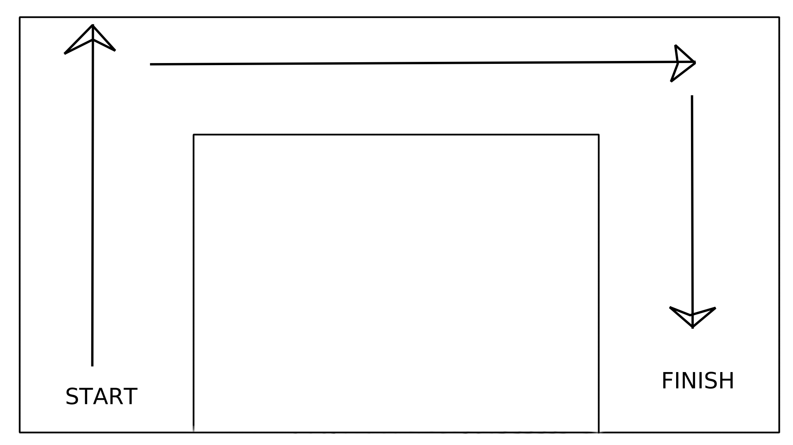
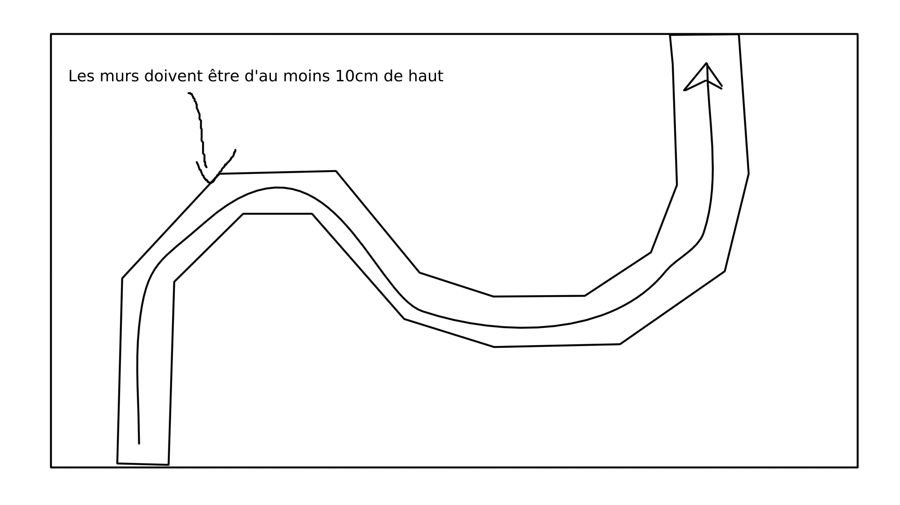

# Exercices

### Robots
- Robot v1

## Dimensions minimum
- hauteur des délimitations: ~10cm (Pour pouvoir marcher avec le capteur infrarouge)

### Exercice 1

#### Un exercice simple où l'ulisateur va devoir faire aller son robot tout d'abord tout droit, puis à droite et enfin encore à droite.
Cet exercice permet de tester la capacité du robot à se déplacer, de l'orienter et de se déplacer, mais aussi si l'utilisateur en a envie, il pourra utiliser le capteur infrarouge pour pour trouver les conditions de ses changements de trajectoires.

### Exercice 2

#### Un exercice un peu plus dûr où l'utilisateur devra utilise le capteur infrarouge pour trouver les conditions de ses changements de trajectoires.
Le 'circuit' aura des 'courbes' qui rendront plus difficile la capacité du robot à suivre la bonne trajectoire.